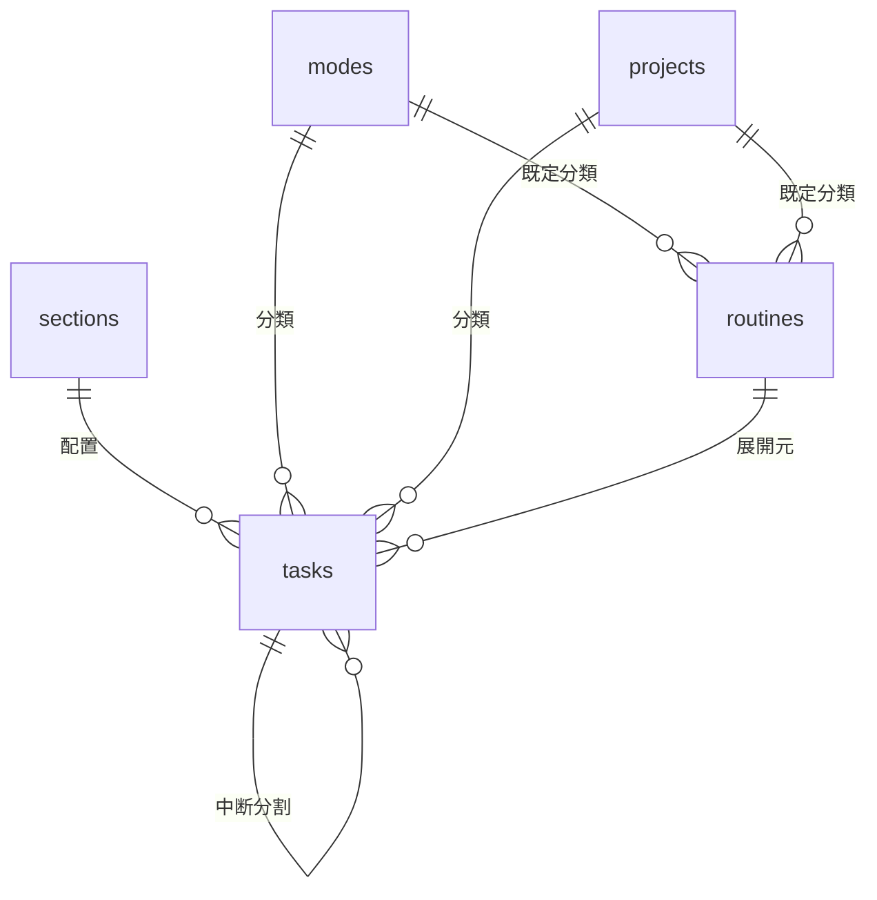

# Hitosuji（ひとすじ） データモデル定義書

- 版数: 0.1（ドラフト）
- 作成日: 2026-07-16
- 上位文書: [要件定義書](./要件定義書.md)

---

## 1. 方針

- DBは PostgreSQL（Neon）。スキーマは Drizzle ORM で管理する
- シングルユーザーのため `users` テーブルは持たない（認証はBasic認証、N-03）
- マスタ（セクション・モード・プロジェクト）は物理削除ではなくアーカイブフラグで無効化し、過去タスクからの参照を保つ
- **並び順カラム（sort_order）はタスク以外持たない**。sections は start_time 昇順、modes / projects は name 昇順（**自然順ソート**: `2.` が `10.` より前）、routines は scheduled_start_time（開始想定時刻）昇順で表示・展開する。modes / projects の並びを制御したい場合は名前に `01.` 等の接頭辞を付ける運用とする（オーナー確認済み）。tasks.sort_order のみ、手動並び替え（F-102）を保持するために維持する
- タスクのログ（打刻済みレコード）は不変を原則とし、ルーチン編集等の影響を受けない
- **日界（1日の開始時刻）の将来導入に備える**: `task_date` は保存された論理日付であり、打刻時刻（timestamptz）から導出しない。このため日界を後から導入しても既存データは影響を受けず、変更点は「今日」の解決（アプリ起動時の表示日・ルーチン展開対象日・終了予定計算の対象日）とセクション表示順の回転（§3.1）に閉じる。MVP は 0:00 固定（要件定義書 §8-5）

## 2. ER図



## 3. テーブル定義

**全テーブル共通カラム**（以下の各表では省略）: `created_at` / `updated_at`（timestamptz, NOT NULL。updated_at はアプリ層で更新時に設定）

### 3.1 sections（セクション）

1日を区切る時間帯の枠。

| カラム | 型 | 制約 | 説明 |
|---|---|---|---|
| id | serial | PK | |
| name | text | NOT NULL | 例: 朝、午前、午後、夜、深夜 |
| start_time | time | NOT NULL | セクション開始時刻 |
| is_archived | boolean | NOT NULL DEFAULT false | |

- **並び順カラムは持たない**。表示順は `start_time` 昇順の導出とする（時刻という自然な順序があり、二重管理を避けるため）。将来「1日の開始時刻」（日界）設定を導入する場合も `(start_time − 日界起点 + 24h) % 24h` のソートで対応する
- **終了時刻カラムも持たない**。各セクションの終了時刻 = start_time 昇順で次のセクションの開始時刻（最終セクションは翌日の先頭セクション開始まで）として導出する。これにより**有効なセクションは常に24時間を隙間・重複なく敷き詰める**。バリデーションは start_time の重複禁止と「有効セクション最低1件」のみで済む。睡眠などの非計画帯も「深夜」等のセクションとして表現する（オーナー確認済み）
- セクション枠の長さ（F-110 の分母）= 導出した終了時刻 − start_time

### 3.2 modes（モード）

動作・活動の種類（色付き分類）。

| カラム | 型 | 制約 | 説明 |
|---|---|---|---|
| id | serial | PK | |
| name | text | NOT NULL | 例: 執筆、会議、休憩 |
| color | text | NOT NULL | HEXカラー（例: `#e05252`） |
| is_archived | boolean | NOT NULL DEFAULT false | |

### 3.3 projects（プロジェクト）

ゴールに向かうタスクのまとまり。

| カラム | 型 | 制約 | 説明 |
|---|---|---|---|
| id | serial | PK | |
| name | text | NOT NULL | |
| is_archived | boolean | NOT NULL DEFAULT false | 完了・中止したプロジェクトはアーカイブ |

### 3.4 routines（ルーチン）

| カラム | 型 | 制約 | 説明 |
|---|---|---|---|
| id | serial | PK | |
| name | text | NOT NULL | 生成タスクのタスク名になる |
| estimate_minutes | integer | NOT NULL | 見積もり（分） |
| scheduled_start_time | time | NOT NULL | **開始想定時刻**。展開時の生成順（昇順）と配置先セクションの導出に使う。実行を固定する予約時刻ではない |
| mode_id | integer | FK → modes, NULL可 | |
| project_id | integer | FK → projects, NULL可 | |
| recurrence_type | text | NOT NULL | `daily` / `weekly` / `monthly` / `interval` |
| weekdays | integer | NULL可 | weekly用。ビットマスク（bit0=月 … bit6=日） |
| month_day | integer | NULL可 | monthly用。1〜31（月末超過は月末に丸め） |
| interval_days | integer | NULL可 | interval用。n日ごと |
| start_date | date | NOT NULL | この日以降に展開対象となる。interval の起算日を兼ねる |
| end_date | date | NULL可 | 指定時、この日を過ぎたら展開しない |
| is_active | boolean | NOT NULL DEFAULT true | F-303 の有効/無効 |

### 3.5 tasks（タスク）

プランとログを兼ねる中心テーブル。打刻の有無で状態が決まる。

| カラム | 型 | 制約 | 説明 |
|---|---|---|---|
| id | serial | PK | |
| task_date | date | NOT NULL | 所属する日付。先送り（F-107）はこの値の付け替え |
| name | text | NOT NULL | |
| estimate_minutes | integer | NOT NULL DEFAULT 0 | 見積もり（分）。0 = 未設定扱い |
| section_id | integer | FK → sections, NULL可 | |
| mode_id | integer | FK → modes, NULL可 | |
| project_id | integer | FK → projects, NULL可 | |
| sort_order | integer | NOT NULL | 日内の表示順（セクション内で連続とは限らないグローバル順）。**task_date ごとに独立した間隔採番**（下記） |
| started_at | timestamptz | NULL可 | 開始打刻（F-201） |
| ended_at | timestamptz | NULL可 | 終了打刻（F-201） |
| comment | text | NULL可 | 一言コメント（F-206, Phase 2） |
| routine_id | integer | FK → routines, NULL可 | ルーチン展開で生成された場合の展開元 |
| split_parent_id | integer | FK → tasks, NULL可 | 中断（F-204）で生成された場合の元タスク |
| postponed_count | integer | NOT NULL DEFAULT 0 | 先送り（F-107）された回数。Phase 2 の先送り数集計（F-502）用に Phase 1 から記録する |

**制約・インデックス**

| 名称 | 定義 | 目的 |
|---|---|---|
| uq_tasks_routine_date | UNIQUE (routine_id, task_date) ※routine_id IS NOT NULL のみ（部分ユニーク） | ルーチン展開の冪等性（F-301） |
| ix_tasks_date | INDEX (task_date) | 日付単位取得の性能（N-01, N-08） |
| ck_tasks_time | CHECK (ended_at IS NULL OR started_at IS NOT NULL) および (ended_at >= started_at) | 打刻の整合性（F-203） |

**タスクの状態（打刻から導出。状態カラムは持たない）**

| 状態 | 条件 |
|---|---|
| 未実行 | started_at IS NULL |
| 実行中 | started_at IS NOT NULL AND ended_at IS NULL |
| 完了 | ended_at IS NOT NULL |

- 実行中タスクはシステム全体で最大1件（アプリ層で保証）。実行中タスクがある状態での別タスク開始は「割り込み」として §4.2 の中断処理を伴う（F-201）
- 実績時間 = ended_at − started_at（分）。中断で分割されたタスク群の合計が実質の所要時間になる（F-204）

**sort_order の採番規則（間隔採番）**

- 表示順は `セクション（start_time 順）→ sort_order` で決まる。sort_order の比較は同一 task_date・同一セクション内でのみ意味を持つ
- 連番ではなく 1000 刻みで採番し、途中挿入は前後の中間値を振る（挿入1件 = 書き込み1行で完結させる）。中間値が尽きた（前後の差が1になった）ときのみ、その日の中で全体を振り直す
- 末尾追加・ルーチン展開: セクション内最大値 +1000 ／ 途中挿入・並び替え: 前後の中間値 ／ セクション移動・先送り: 移動先セクション末尾の値 +1000（先送りは移動先日付で振り直し）

## 4. 主要ロジックとデータの関係

### 4.1 ルーチン展開（F-301）

デイリーリスト（S-01）で日付 D を表示するたびに、サーバ側で:

0. **D が当日以降の場合のみ**展開を行う（過去日は展開しない。過去のログに未実行タスクを混入させないため）
1. `is_active` かつ `start_date <= D <= end_date(なければ∞)` のルーチンから、recurrence_type ごとの判定で D に該当するものを抽出
   - daily: 常に該当 / weekly: D の曜日が weekdays に含まれる / monthly: D の日 = month_day（月末丸め）/ interval: (D − start_date) % interval_days = 0
2. 該当ルーチンを scheduled_start_time 昇順（同時刻は name の自然順）に並べ、各ルーチンの開始想定時刻を含む有効セクションを導出して生成タスクの section_id に設定する（セクションは24時間を敷き詰めるため必ず一意に定まる。§3.1）
3. tasks へ INSERT（`ON CONFLICT (routine_id, task_date) DO NOTHING` で冪等）。tasks.sort_order は既存タスクの並びを崩さないよう、導出セクション内の末尾に上記の順で採番する

表示のたびに実行して冪等 INSERT で吸収するため、後から追加・再有効化されたルーチンは対象日を次に表示した時点で不足分だけ追加展開される。バックフィル（表示していない日の一括展開）はしない。

### 4.2 中断（F-204）

中断は次の2つの契機で発生する。いずれも1トランザクションで処理する。

- **(a) 明示的な中断操作**（S-01 O-4）: 再開タスク T' を **T の直後**に配置する
- **(b) 割り込み開始**（実行中タスク T がある状態で別タスク B を開始。F-201）: T を終了し、T' を **B の直下**に配置したうえで B.started_at = now() とする（T' のセクションは B のセクションに従う）

共通処理:

1. T.ended_at = now()
2. 再開タスク T' を INSERT: name/mode/project は T と同値、section_id と sort_order は上記の配置位置に従う、estimate_minutes = max(T.estimate − T実績, 1)、split_parent_id = T.id

### 4.3 終了予定時刻（F-104）

DBには保存しない導出値。当日リストに対しクライアントで計算:

```
終了予定時刻 = now
  + (実行中タスク: max(見積もり − 経過, 0))
  + Σ(未実行タスクの見積もり)
```

## 5. 初期データ（シード）

Phase 1 リリース時に以下を投入する（要件定義書 §8-2 で決定済み。投入後はマスタ管理画面で自由に変更できる）。

- sections: 朝 6:00 / 午前 9:00 / 午後 12:00 / 夜 18:00 / 深夜 0:00（終了時刻は次セクションの開始から導出。例: 夜 = 18:00–24:00、深夜 = 0:00–6:00）
- modes: 仕事(青) / 暮らし(緑) / 休憩(灰) など数個
- projects: 空（運用開始後に作成）

## 6. バックアップ（N-06）

- 週次で `pg_dump`（カスタム形式）を取得する手順を README に記載。GitHub Actions の cron による自動化を推奨（Neon の接続文字列は Actions secrets に保管）
- リストアは `pg_restore` で任意の Postgres へ可能なことを、Phase 1 完了時に一度実演して確認する
