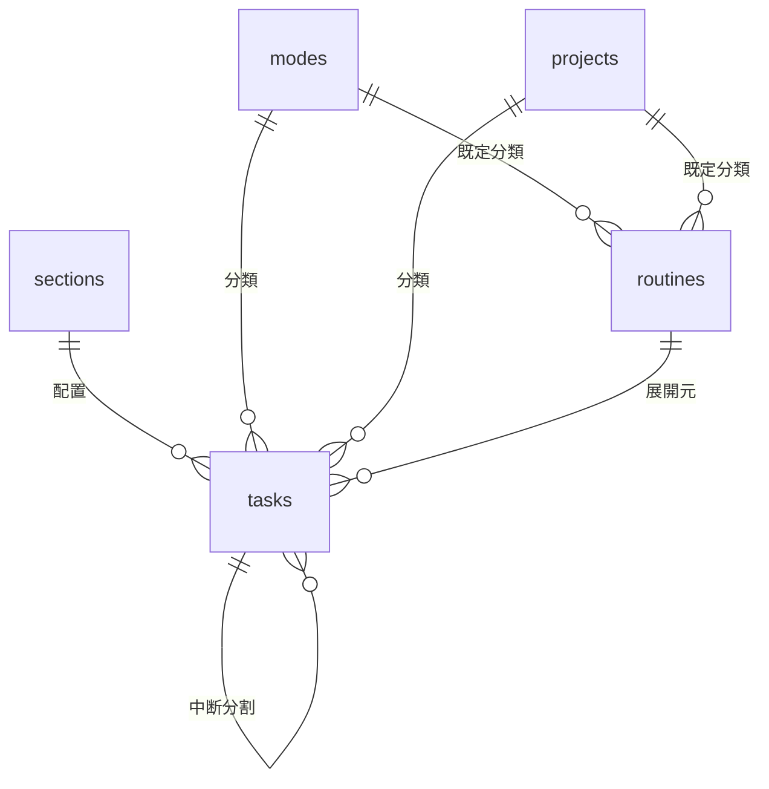

# Hitosuji（ひとすじ） データモデル定義書

- 版数: 1.0
- 作成日: 2026-07-16
- 更新日: 2026-07-26
- 上位文書: [要件定義書](./12_要件定義書.md)

---

## 1. 方針

- DBは PostgreSQL（Neon）。スキーマは Drizzle ORM で管理する
- シングルユーザーのため `users` テーブルは持たない（認証はBasic認証、N-03）
- マスタ（セクション・モード・プロジェクト）は物理削除ではなくアーカイブフラグで無効化し、過去タスクからの参照を保つ
- **並び順カラム（sort_order）はタスク以外持たない**。sections は start_time 昇順、modes / projects は name 昇順（**自然順ソート**: `2.` が `10.` より前）、routines は scheduled_start_time（開始想定時刻）昇順で表示・展開する。modes / projects の並びを制御したい場合は名前に `01.` 等の接頭辞を付ける運用とする（オーナー確認済み）。tasks.sort_order のみ、手動並び替え（F-102）を保持するために維持する
- タスクのログ（打刻済みレコード）は不変を原則とし、ルーチン編集等の影響を受けない
- **日界（1日の開始時刻）は日界セクション（`sections.is_day_start`）で定める**（F-116）: `task_date` は保存された論理日付であり、打刻時刻（timestamptz）から導出しない。このため日界を変えても既存データは影響を受けず、変更点は「今日」の解決（表示日・ルーチン展開対象日・終了予定計算の対象日）とセクション表示順の回転（§3.1）に閉じる。既定は深夜(00:00)＝0:00 固定と同じ挙動

## 2. ER図



## 3. テーブル定義

**全テーブル共通カラム**（以下の各表では省略）: `created_at` / `updated_at`（timestamptz, NOT NULL。updated_at はアプリ層で更新時に設定）

### 3.1 sections（セクション）

1日を区切る時間帯の枠。

| カラム | 型 | 制約 | 説明 |
|---|---|---|---|
| id | serial | PK | |
| name | text | NOT NULL | 例: 朝、午前、午後、夜、深夜。50文字以内（アプリ層で検証） |
| start_time | time | NOT NULL | セクション開始時刻 |
| is_archived | boolean | NOT NULL DEFAULT false | |
| is_day_start | boolean | NOT NULL DEFAULT false | **日界セクション**（1日の開始）。有効セクション内でちょうど1件が true（日界時刻＝この行の start_time）。F-116 |

- **並び順カラムは持たない**。表示順は日界セクション（`is_day_start`）を起点に `(start_time − 日界 + 24h) % 24h` 昇順で導出する（回転。F-116）。日界が深夜 00:00 のときは通常の `start_time` 昇順に一致する。時刻という自然な順序があり二重管理を避けるため、並び順カラムは持たない
- **日界セクション（`is_day_start`）**: 有効セクションのうちちょうど1件を1日の開始に指定する。部分ユニーク索引（`where is_archived = false and is_day_start = true`）で有効内の重複を禁止（最大1件）、最低1件はアプリ層で保証する。**日界セクションはアーカイブできない**（先に別の有効セクションを日界に指定する。「有効セクション最低1件」と同種の制約）。既定（シード）は深夜(00:00)。選択UIは画面定義書03 §3.1
- **終了時刻カラムも持たない**。各セクションの終了時刻 = start_time 昇順で次のセクションの開始時刻（最終セクションは翌日の先頭セクション開始まで）として導出する。これにより**有効なセクションは常に24時間を隙間・重複なく敷き詰める**。バリデーションは start_time の重複禁止・「有効セクション最低1件」・「日界セクション1件」のみで済む。睡眠などの非計画帯も「深夜」等のセクションとして表現する（オーナー確認済み）
- セクション枠の長さ（F-110 の分母）= 導出した終了時刻 − start_time

### 3.2 modes（モード）

動作・活動の種類（色付き分類）。

| カラム | 型 | 制約 | 説明 |
|---|---|---|---|
| id | serial | PK | |
| name | text | NOT NULL | 例: 執筆、会議、休憩。50文字以内（アプリ層で検証） |
| color | text | NOT NULL | HEXカラー。プリセット13色のいずれか（画面定義書03 §3.2） |
| is_archived | boolean | NOT NULL DEFAULT false | |

### 3.3 projects（プロジェクト）

ゴールに向かうタスクのまとまり。

| カラム | 型 | 制約 | 説明 |
|---|---|---|---|
| id | serial | PK | |
| name | text | NOT NULL | 50文字以内（アプリ層で検証） |
| is_archived | boolean | NOT NULL DEFAULT false | 完了・中止したプロジェクトはアーカイブ |

### 3.4 routines（ルーチン）

| カラム | 型 | 制約 | 説明 |
|---|---|---|---|
| id | serial | PK | |
| name | text | NOT NULL | 生成タスクのタスク名になる |
| estimate_minutes | integer | NOT NULL | 見積もり（分） |
| scheduled_start_time | time | NOT NULL | **開始想定時刻**。展開時の生成順（昇順）と配置先セクションの導出に使う。実行を固定する予約時刻ではない |
| mode_id | integer | FK → modes, NULL可 | |
| project_id | integer | FK → projects, NULL可 | |
| recurrence_type | text | NOT NULL | `daily` / `weekly` / `monthly` / `interval` |
| weekdays | integer | NULL可 | weekly用。ビットマスク（bit0=月 … bit6=日） |
| week_interval | integer | NULL可 | weekly用。n週おき（1=毎週・2=隔週…）。**値域は 1〜53**（1年が触れうる最大週数。CHECK で担保）。NULL は 1（毎週）として扱う。§4.1 の起算は下記 |
| month_day | integer | NULL可 | monthly用。1〜31（月末超過は月末に丸め） |
| interval_days | integer | NULL可 | interval用。n日ごと |
| start_date | date | NOT NULL | この日以降に展開対象となる。interval の起算日／weekly の週間隔の起算週（この日を含む週＝第0週）を兼ねる |
| end_date | date | NULL可 | 指定時、この日を過ぎたら展開しない |
| is_active | boolean | NOT NULL DEFAULT true | F-303 の有効/無効 |

### 3.5 tasks（タスク）

プランとログを兼ねる中心テーブル。打刻の有無で状態が決まる。

| カラム | 型 | 制約 | 説明 |
|---|---|---|---|
| id | serial | PK | |
| task_date | date | NOT NULL | 所属する日付。先送り（F-107）はこの値の付け替え |
| name | text | NOT NULL | |
| estimate_minutes | integer | NOT NULL DEFAULT 0 | 見積もり（分）。0 = 未設定扱い |
| section_id | integer | FK → sections, NULL可 | |
| mode_id | integer | FK → modes, NULL可 | |
| project_id | integer | FK → projects, NULL可 | |
| sort_order | integer | NOT NULL | 日内の表示順（セクション内で連続とは限らないグローバル順）。**task_date ごとに独立した間隔採番**（下記） |
| started_at | timestamptz | NULL可 | 開始打刻（F-201） |
| ended_at | timestamptz | NULL可 | 終了打刻（F-201） |
| comment | text | NULL可 | 一言コメント（F-206。列のみ用意し、UI は未実装） |
| routine_id | integer | FK → routines, NULL可 | ルーチン展開で生成された場合の展開元 |
| split_parent_id | integer | FK → tasks, NULL可 | 中断（F-204）で生成された場合の元タスク |
| postponed_count | integer | NOT NULL DEFAULT 0 | 先送り（F-107）された通算回数。**記録のみで表示・集計には使っていない**（先送り数 F-502 は「その日に残っている未実行タスク」で数えるため）。導出も遡及もできない事実なので記録は続ける |

**制約・インデックス**

| 名称 | 定義 | 目的 |
|---|---|---|
| uq_tasks_routine_date | UNIQUE (routine_id, task_date) ※routine_id IS NOT NULL のみ（部分ユニーク） | ルーチン展開の冪等性（F-301） |
| ix_tasks_date | INDEX (task_date) | 日付単位取得の性能（N-01, N-08） |
| ck_tasks_time | CHECK (ended_at IS NULL OR started_at IS NOT NULL) および (ended_at >= started_at) | 打刻の整合性（F-203） |

**タスクの状態（打刻から導出。状態カラムは持たない）**

| 状態 | 条件 |
|---|---|
| 未実行 | started_at IS NULL |
| 実行中 | started_at IS NOT NULL AND ended_at IS NULL |
| 完了 | ended_at IS NOT NULL |

- 実行中タスクはシステム全体で最大1件（アプリ層で保証）。実行中タスクがある状態での別タスク開始は「割り込み」として §4.2 の中断処理を伴う（F-201）
- 実績時間 = ended_at − started_at（分）。中断で分割されたタスク群の合計が実質の所要時間になる（F-204）

**sort_order の採番規則（間隔採番）**

- 表示順は `セクション（start_time 順）→ sort_order` で決まる。sort_order の比較は同一 task_date・同一セクション内でのみ意味を持つ
- 連番ではなく 1000 刻みで採番し、途中挿入は前後の中間値を振る（挿入1件 = 書き込み1行で完結させる）。中間値が尽きた（前後の差が1になった）ときのみ、**挿入先のセクション内**を振り直す（範囲をセクション内に絞る根拠は決定ログ）
- 末尾追加・ルーチン展開: セクション内最大値 +1000 ／ 途中挿入・並び替え: 前後の中間値 ／ セクション移動・先送り: 移動先セクション末尾の値 +1000（先送りは移動先日付で振り直し）

### 3.6 routine_skips（特定日のルーチンスキップ）

展開されたタスクを削除したとき、その日にそのルーチンを再展開しないための記録（F-304 のスキップ）。

| カラム | 型 | 制約 | 説明 |
|---|---|---|---|
| id | serial | PK | |
| routine_id | integer | NOT NULL, FK → routines ON DELETE CASCADE | ルーチンを削除すればスキップも不要になる |
| task_date | date | NOT NULL | スキップする日 |

**制約・インデックス**

| 名称 | 定義 | 目的 |
|---|---|---|
| uq_routine_skips | UNIQUE (routine_id, task_date) | 同じ日のスキップは1件（記録も冪等にする） |

- スキップは**展開されたタスクの削除**によって作られ、**削除の取り消し（Undo）で解除**される
- ルーチン本体・他の日の展開には影響しない。スキップした日を再表示しても展開されない
- 過去日のスキップ記録は残るが害がないため削除しない（レビュー機能で「その日やらなかった」根拠として使える可能性がある）

## 4. 主要ロジックとデータの関係

### 4.1 ルーチン展開（F-301）

デイリーリスト（S-01）で日付 D を表示するたびに、サーバ側で:

0. **D が当日以降の場合のみ**展開を行う（過去日は展開しない。過去のログに未実行タスクを混入させないため）
1. `is_active` かつ `start_date <= D <= end_date(なければ∞)` のルーチンから、recurrence_type ごとの判定で D に該当するものを抽出
   - daily: 常に該当 / weekly: D の曜日が weekdays に含まれ、**かつ D の週が対象週**（start_date を含む週を第0週とし、**月曜始まり**で数えて週番号 % week_interval = 0。week_interval が 1 または NULL なら毎週該当）/ monthly: D の日 = month_day（月末丸め）/ interval: (D − start_date) % interval_days = 0
   - **`routine_skips` に (routine_id, D) がある場合は除外する**（その日は展開しない。§3.6）
2. 該当ルーチンを scheduled_start_time 昇順（同時刻は name の自然順）に並べ、各ルーチンの開始想定時刻を含む有効セクションを導出して生成タスクの section_id に設定する（セクションは24時間を敷き詰めるため必ず一意に定まる。§3.1）
3. tasks へ INSERT（`ON CONFLICT (routine_id, task_date) DO NOTHING` で冪等）。tasks.sort_order は既存タスクの並びを崩さないよう、導出セクション内の末尾に上記の順で採番する

表示のたびに実行して冪等 INSERT で吸収するため、後から追加・再有効化されたルーチンは対象日を次に表示した時点で不足分だけ追加展開される。バックフィル（表示していない日の一括展開）はしない。

### 4.2 中断（F-204）

中断は次の2つの契機で発生する。いずれも1トランザクションで処理する。

- **(a) 明示的な中断操作**（S-01 O-4）: 再開タスク T' を **T の直後**に配置する
- **(b) 割り込み開始**（実行中タスク T がある状態で別タスク B を開始。F-201）: T を終了し、T' を **B の直下**に配置したうえで B.started_at = now() とする（T' のセクションは B のセクションに従う）
  - B が自動セクション移動（§4.4 / 画面定義書01 §4.2-a）の対象になる場合、**処理順は ① B を移動 → ② 移動後の B の直下に T' を配置 → ③ B.started_at = now()**。T' のセクションも移動後の B に従う（同一トランザクション）

共通処理:

1. T.ended_at = now()
2. 再開タスク T' を INSERT: name/mode/project は T と同値、section_id と sort_order は上記の配置位置に従う、split_parent_id = T.id
   - estimate_minutes = **T の見積もりが未設定（0分）なら 0（未設定のまま引き継ぐ）**、設定済みなら max(T.estimate − T実績, 1)
   - **T と B の task_date が異なる場合**（前日以前の実行中タスクを当日のタスクで割り込んだ場合）、T' は B と同じ task_date に生成する。「実行中は全体で最大1件」は全日付を通じて保証し、前日の未完了分は当日のリストへ繰り越される

### 4.3 終了予定時刻（F-104）・セクション残り時間（F-110）

DBには保存しない導出値。**表示日のリストに属するタスクのみを対象**にクライアントで計算する（前日以前から放置されている実行中タスクは含めない。放置分は画面定義書01 §8 の警告バナーで別途知らせる）:

```
終了予定時刻 = now
  + (実行中タスク: max(見積もり − 経過, 0))
  + Σ(未実行タスクの見積もり)
```

上式右辺の `now` 以降の項を**未完了見積もり**と呼ぶ（実行中の残り＋未実行の見積もり合計）。

**未実行タスクの予想開始時刻（F-120）**: 上の積み上げの途中経過。表示順（画面定義書01 §3.2 の回転順 → `sort_order`）に並べた未実行タスクを上から積む:

```
予想開始時刻(i番目の未実行タスク) = now
  + (実行中タスク: max(見積もり − 経過, 0))
  + Σ(それより前にある未実行タスクの見積もり)
```

セクションをまたいでも積み上げをリセットしない（セクション開始時刻を起点にしない）。見積もり未設定（0分）のタスクは 0 として積むため、直前のタスクと同じ時刻になる（終了予定時刻に含めない扱い〈F-103〉と同じ帰結）。実行中タスクの残りは**表示順の位置に依らず**常に起点へ含める（未実行行が実行中タスクより上にあっても引かない）——これにより「最後の未実行タスクの予想開始 ＋ その見積もり ＝ 終了予定時刻」が保たれる。**表示可否・書式などの UI 詳細は画面定義書01 §3.3**。

**セクションの残り時間（F-110）**: 同じ未完了見積もりを、対象セクションのタスクに限って求め、時間帯の残りから引く:

```
セクション残り時間 = (セクション終了時刻 − now) − そのセクションの未完了見積もり
```

現在時刻に依存する導出値。マイナスはそのセクションに予定が収まらないことを表す。**表示可否・符号・色などの UI 詳細は画面定義書01 §3.2**。

**日界（F-116）との関係**: 終了予定時刻の折返し表記（`25:30` 形式）と 24:00 超過の警告は、暦日 0:00 ではなく**表示中の論理日の区切り（日界）**を基準にする（1日は日界セクション開始で始まり、次の日界で終わる）。折返しの時計数字は論理日の暦日 0:00 起点のまま（例: 朝の予定が翌 2:00 に及べば `26:00`）、超過警告は予定終了が次の日界を越えるときに出す。既定の深夜 00:00 では暦日 24:00 と一致する。セクション終了時刻・セクション枠（§3.1）は表示順の回転に影響されない（巡回順で次セクション開始を終了とする導出が回転で不変のため）。

### 4.4 タスクの自動セクション移動（F-113）

挙動の契約は画面定義書01 §4.2。ここでは書き換わる列と採番だけを定める。

- **書き換える列**: `tasks.section_id` と `tasks.sort_order` のみ。打刻列（`started_at` / `ended_at`）・`task_date` は触らない
- **対象行**: `task_date` = 今日 の行のうち、
  - 画面定義書01 §4.2 規則a（開始時）: **開始したタスク自身**の1行のみ。`started_at` を書き込むのと同一トランザクションで移す（`section_id IS NULL` の未分類からも移る）
  - 同 規則b（繰り下げ）: `started_at IS NULL` かつ `section_id IS NOT NULL` の行
  - 同 規則c（開始時刻の修正時）: **修正したタスク自身**の1行のみ。`started_at` を書き換えるのと同一トランザクションで移す。`ended_at` の有無（実行中／完了）を問わない
- **採番**: 移動先の直前・直後の `sort_order` の中間値を取る間隔採番（§3.5）。複数件をまとめて繰り下げる場合は、元の相対順序を保ったまま連続した位置へ割り当てる。中間値が取れなくなったら移動先セクション内を1000刻みで振り直す（§3.5 の再採番と同じ）
  - 規則c の挿入位置は**移動先セクション内の `started_at` 昇順**で決める。`started_at IS NULL` の行（未実行）は打刻済みの行より後ろにあるものとして扱い、その直前に入れる
- **トランザクション**: まとめて移動する複数行の更新は1トランザクションで行う（途中まで移動した状態を残さない）
- **冪等性**: 同じ状態に対して何度実行しても結果が変わらないこと（デイリー表示のたびに走るため。ルーチン展開 §4.1 と同じ性質）

### 4.5 開始打刻の取り消し（F-210）

挙動の契約は画面定義書01 O-13。ここでは書き換わる列と採番だけを定める。

- **対象**: 実行中（`started_at IS NOT NULL` かつ `ended_at IS NULL`）のタスク1行のみ
- **書き換える列**: `started_at` を null に戻す。表示日が今日のときは並べ直しのため `section_id`・`sort_order` も更新する（今日でなければ `started_at` のみ）。`ended_at`・`task_date` はいずれも触らない
- **戻し位置（表示日が今日）**: 開始前の位置は復元せず、未実行として**「現在位置」**へ置く。当該タスクを取り消すと実行中がいなくなるため、現在位置は画面定義書01 §4.2 の定義により**現在時刻を含むセクションの未実行タスクの先頭**となる（＝要件・O-13 が言う「現在時刻を含むセクションの先頭」）。`sort_order` はその位置へ間隔採番（§3.5）で入れる
- **戻し位置（表示日が今日でない）**: 並べ直さず `started_at` のクリアのみ（`section_id`・`sort_order` は変えない）
- **割り込みで開始していた場合**: 波及なし。終了させた直前タスクの `ended_at`、生成済みの再開タスク（`split_parent_id`）はいずれもそのまま残す
- **トランザクション**: 上記の列更新は1トランザクションで行う

### 4.6 完了タスクの複製して開始（F-208）

挙動の契約は画面定義書01 O-14。採番は新規規則を持たず、複製（F-111 / 画面定義書01 O-11）と開始（§4.2）の合成で定める。

- **生成する行**: 完了タスクの複製を1行作る。引き継ぐ列は O-11 と同じ（`name`・`estimate_minutes`〈満額〉・`mode_id`・`project_id`）。`routine_id`・`split_parent_id`・コメントは引き継がず、`postponed_count = 0`、`started_at = now()`、`ended_at = NULL`
- **配置**: 複製行の `task_date` は複製元と同じ（表示日）。開始状態で作るため次のセクションへ間隔採番（§3.5）で末尾配置する。他に実行中タスク T があれば本書 §4.2(b) の割り込み（T を終了し再開タスク T' を複製行の直下へ）を伴う
  - **表示日が今日**: 画面定義書01 §4.2 規則a（開始時の自動セクション移動）に従い**現在時刻を含むセクション**へ置く（有効セクションは24時間を敷き詰めるので必ず一意に定まる〈§3.1〉。早朝など最早セクションの開始前は日をまたぐ最後のセクションに属する。有効セクションが1つも無い退避時のみ複製元と同じセクション）
  - **表示日が今日でない**: 規則a は今日のみが対象（画面定義書01 §4.2）のため適用せず、**複製元と同じセクション**へ置く（F-201・F-210 と同じ「今日でなければ動かさない」慣習）
- **複製元**: 完了のまま変更しない
- **トランザクション**: 複製行の生成・開始・（あれば）割り込みを1トランザクションで行う。楽観的更新の対象外（`sort_order` をサーバが採番するため）
- **取り消し**: F-208 専用の取り消しは持たない。開始直後の `U` は複製行に対する開始打刻の取り消し（§4.5 / F-210）として働き、複製行は未実行として残る

### 4.7 完了の取り消し（F-212）

挙動の契約は画面定義書01 O-15。ここでは書き換わる列・採番と、取り消し（復帰）に要する情報だけを定める。**スキーマ変更は伴わない**（既存列の書き換えのみ）。

- **対象**: 完了（`ended_at IS NOT NULL`）のタスク1行のみ
- **書き換える列**: `started_at`・`ended_at` を**ともに** null に戻す。表示日が今日のときは並べ直しのため `section_id`・`sort_order` も更新する（今日でなければ打刻列のみ）。`task_date` は触らない
- **戻し位置**: §4.5（開始打刻の取り消し）と同じ規則。未実行として**「現在位置」**＝現在時刻を含むセクションの未実行タスクの先頭へ間隔採番（§3.5）で入れる。完了を取り消しても実行中タスクの有無は変わらないため、実行中タスクが別にあればその直後が現在位置になる
- **割り込み・中断への波及**: なし。中断・割り込みで生成された再開タスク（`split_parent_id`）も、割り込みで終了させた直前タスクもそのまま残す（§4.5 と同じ）
- **取り消し（復帰）**: 操作前の `started_at`・`ended_at`・`section_id`・`sort_order` の4列をクライアントが保持し、復帰時はその値で書き戻す（削除の取り消しが削除行のスナップショットを持つのと同じ方式。画面定義書01 O-8）。`sort_order` にユニーク制約は無いため、復帰までの間に他タスクが同値を取っていても書き戻せる（同値どうしの順は不定になるが単一利用者のため許容する）。保留は削除と共通で常に1つ（画面定義書01 O-13）
- **トランザクション**: 取り消し・復帰とも、上記の列更新を1トランザクションで行う

## 5. 初期データ（シード）

新しい環境を立ち上げるときに投入する初期値（投入後はマスタ管理画面で自由に変更できる）。**ここが初期データの正**。

- sections: 朝 6:00 / 午前 9:00 / 午後 12:00 / 夜 18:00 / **深夜 0:00（`is_day_start` = true、既定の日界セクション）**（終了時刻は次セクションの開始から導出。例: 夜 = 18:00–24:00、深夜 = 0:00–6:00）
- modes: 仕事(青) / 暮らし(緑) / 休憩(グレー) など数個（色名は[画面定義書03](./13_画面定義書/03_マスタ管理.md) §3.2 のプリセット13色の名称を使う）
- projects: 空（運用開始後に作成）

## 6. バックアップ（N-06）

方針は要件定義書 §6 N-06、手順とコマンドは README（`npm run db:backup` / `npm run db:restore`）を正とする（復元手順は 2026-07-20 に本番ダンプで実演・確認済み）。

## 7. 決定ログ

データ構造・主要ロジックの判断は[log_14_データモデル定義書.md](./log_14_データモデル定義書.md)に日付順で積む。
